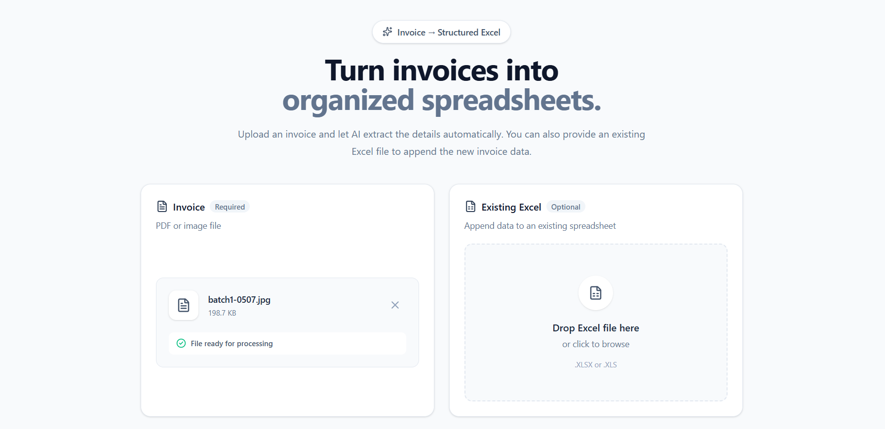

<p align="center">
  
</p>

# Invoice Data Parser

An AI-powered invoice parser that extracts invoice information from PDF and image files and saves the extracted data into an Excel spreadsheet.

## Features

- Extracts text from PDF invoices
- Extracts text from invoice images using OCR
- Uses a local LLM to understand and structure invoice data
- Supports single or multiple invoices in a PDF
- Extracts invoice details and line items
- Creates an Excel file automatically
- Can append data to an existing Excel file
- Simple React frontend
- FastAPI backend

## Project Structure

```text
invoice-data-parser/
│
├── backend/
│   ├── app.py
│   ├── main.py
│   ├── text_extractor.py
│   ├── llm_parser.py
│   └── excel_handler.py
│
├── frontend/
│   ├── src/
│   ├── package.json
│   └── ...
│
├── .gitignore
└── README.md
````

## Requirements

Make sure you have:

* Python 3.10+
* Node.js
* Git
* Tesseract OCR
* Ollama

## 1. Clone the Repository

```bash
git clone https://github.com/YOUR_USERNAME/invoice-data-parser.git
cd invoice-data-parser
```

## 2. Setup the Backend

Create a virtual environment:

```bash
python -m venv venv
```

Activate it on Windows:

```bash
venv\Scripts\activate
```

Install Python dependencies:

```bash
pip install fastapi uvicorn python-multipart pypdf pytesseract pillow openpyxl ollama
```

## 3. Install Tesseract OCR

Install Tesseract OCR on your computer.

After installation, make sure Tesseract is available in your system PATH.

You can check it with:

```bash
tesseract --version
```

## 4. Setup Ollama

Install Ollama and download the model used by this project:

```bash
ollama pull qwen2.5:7b
```

Make sure Ollama is running before using the application.

You can check the model with:

```bash
ollama list
```

## 5. Start the Backend

From the project root:

```bash
uvicorn backend.app:app --reload
```

The backend will run at:

```text
http://127.0.0.1:8000
```

API documentation is available at:

```text
http://127.0.0.1:8000/docs
```

## 6. Start the Frontend

Open another terminal and go to the frontend folder:

```bash
cd frontend
```

Install the dependencies:

```bash
npm install
```

Start the frontend:

```bash
npm run dev
```

The frontend will be available at the URL shown in the terminal, usually:

```text
http://localhost:5173
```

## How to Use

1. Open the frontend in your browser.
2. Upload an invoice PDF or image.
3. Optionally upload an existing Excel file.
4. Click **Process Invoice**.
5. Wait while the invoice is processed.
6. Download the generated Excel file.

If an existing Excel file is uploaded, the new invoice data will be added to it.

## Supported Files

### Invoice

* PDF
* JPG / JPEG
* PNG
* BMP
* TIFF

### Excel

* XLSX
* XLS

## How It Works

```text
Invoice PDF/Image
       ↓
Text Extraction / OCR
       ↓
Local LLM (Ollama)
       ↓
Structured Invoice Data
       ↓
Excel Spreadsheet
```

## Important

* Ollama runs the AI model locally on your computer.
* No OpenAI API key is required.
* Do not upload private invoice data to GitHub.
* Test files, generated Excel files, and environment files are excluded using `.gitignore`.

## Future Improvements

* Better handling of complex invoice layouts
* More OCR improvements
* Support for additional document formats
* Improved validation of extracted invoice data
